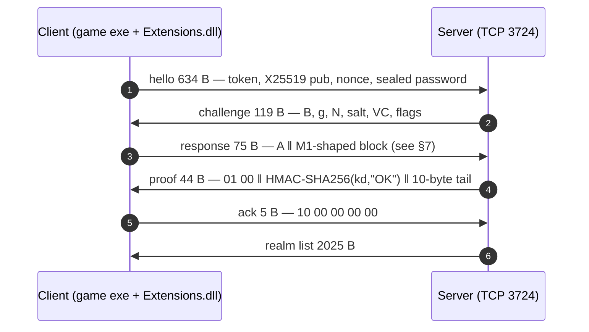

*How a 3.3.5a-based game client authenticates with a modern ECDH handshake — byte layouts, constants, and quirks included.*

---

## TL;DR

- The client logs in with a **custom handshake**: a ~634-byte hello carrying an X25519 public key, a nonce, a machine-fingerprint token, and a sealed password.
- The whole challenge/response dance is **under 3 KB of traffic** on TCP port 3724: hello 634 B → challenge 119 B → response 75 B → proof 44 B → ack 5 B → realm list 2025 B.
- Under the hood it's **textbook crypto in a bespoke protocol**: X25519 with a fixed server public key, HKDF-style key derivation (HMAC-SHA256), ChaCha20 field sealing, and `HMAC-SHA256(kd, "OK")` as the server's proof-of-key.
- The password is **sealed directly with the session key** — the challenge fields play no part in authentication.
- The hello carries a **SHA-256 machine-fingerprint token** (`1|1|<64 hex>`), assembled in part from raw SMBIOS tables.
- The whole thing lives in a **12.6 MB armored DLL**: ~639 runtime code patches, anti-debug techniques, and a bytecode VM that hot-patches the final comparison check.

---

## 1. A custom login path

The subject is a custom client for a long-running 3.3.5a-based realm (build 12340 on the wire, custom content layered on top). The interesting part for this post is a 12.6 MB `Extensions.dll` that the game loads at startup and that **rewrites the process's own code at runtime** — roughly 639 `.text` modifications, of which over 400 are plain `JMP` hooks, plus data patches. The login path is one of the things it rewrites.

The handshake it installs is built from modern primitives — **X25519 key agreement, HKDF-SHA256 key derivation, ChaCha20 sealing, and an HMAC-SHA256 server proof** — wrapped in a custom wire format. It was verified in a lab against locally emulated servers. Nothing about the protocol is standard; the cryptography underneath is admirably textbook.

## 2. The exchange



| # | Message | Direction | Size | Notes |
|---|---|---|---|---|
| 1 | hello | C→S | 629 + password_length | `00 08 76 02 …` on the wire; password length leaks by size |
| 2 | challenge | S→C | 119 | sent in the clear |
| 3 | response | C→S | 75 | content is uninitialized memory in practice |
| 4 | proof | S→C | 44 | the only server message the client truly validates |
| 5 | ack | C→S | 5 | client asks for the realm list |
| 6 | realm list | S→C | 2025 | 18 realms in the captured list |

Total: ~2.9 KB to go from "click Login" to "realm list".

> **Packet-capture footnote:** an early capture contained 6-byte all-zero "messages" interleaved between the real ones. They are not protocol data: **they are Ethernet padding on pure TCP ACKs** — each one reuses the next segment's TCP sequence number, i.e. they occupy zero sequence space. Parsers and replay tools should filter them out; treating them as protocol data disrupts the handshake.

## 3. Framing and masking

Every hello is wrapped in a thin envelope:

```
[2B: 00 08][2B: u16 len (little-endian)][4B: fc f4 f4 e6][16B: tag]  (24 B header)
[masked body: (pt_len − 4) bytes]
[4B: unmasked tail]
```

The body mask is **two layers stacked**:

1. a byte-wise XOR with `0xED`, then
2. XOR with a ChaCha20 keystream (`KC2`, nonce `NC2`, counter = 1).

`KC2`/`NC2` are **fixed constants baked into the DLL** — the same keystream is used for every session of a given build:

```
KC2 = 33ba3128 ee614b58 …   (32 B)
NC2 = 9200018e cafa7d60 e0acc81e   (12 B)
```

So the outer layer is **obfuscation, not confidentiality** — it raises the bar for third-party interoperability rather than protecting the payload. (Notably, the constant `ad 7d 35 70` that appears at offset 24 is not a header field — it is the sealed form of the constant token prefix `1|1|`.)

Note: **the last four bytes of the body are not covered by the outer mask.** They still belong to the last field (the password block), which is sealed separately with the session key — more on that below. Whether deliberate or incidental, a correct parser must reproduce this behavior exactly.

## 4. The hello, field by field

After unmasking, the hello is a 605 + `pwlen` byte structure:

| Offset | Size | Field |
|---|---|---|
| 0 | 256 | version token block: `"1|1|"` + 64 hex + zero padding |
| 256 | 4 | `"WoW\0"` |
| 260 | 3 | client version bytes (`3, 3, 5`) |
| 263 | 2 | build (`12340`) |
| 265 | 4 | architecture, stored reversed (`"68x\0"` = `x86`) |
| 269 | 4 | platform, reversed (`"niW\0"` = `Win`) |
| 273 | 4 | locale, reversed (`"SUne"` = `enUS`) |
| 277 | 4 | u32 `60` — unknown |
| 281 | 4 | IPv4 of the endpoint the client is dialing |
| 285 | 256 | account name, NUL-padded |
| 541 | 32 | **client X25519 public key** |
| 573 | 12 | **nonce** (used to seal the password) |
| 585 | 16 | "pw tag" — role unresolved |
| 601 | 4 | `pwlen` |
| 605 | pwlen | **sealed password**: ChaCha20(kd, nonce, counter=1) |

Two details worth noting:

- The platform/locale/arch strings are **byte-reversed** (`Win` → `niW`) — a subtle detail that easily trips naive parsers.
- **The wire length reveals the password length** (total = 629 + `pwlen`; a 7-character password produces a 636-byte hello, a 5-character password a 634-byte one). A minor information leak, and a reminder to read the length field rather than assume a fixed frame size.

## 5. The crypto core

All of the real cryptography is native code inside `Extensions.dll`, sitting in one contiguous block of the module (RVAs relative to the DLL image):

| Component | RVA | Notes |
|---|---|---|
| RNG | `0xADCDA0` | feeds the ephemeral secret |
| Clamp | `~0xADDB3A` | RFC 7748 clamping |
| X25519 | `0xAE0340…` | donna-style field arithmetic, `fe_mul` @ `0xAE0620`, constant `121666` @ `0xAE1040` |
| SHA-256 + HMAC | `0xADE000–0xADF600` | includes `hmac_multi_algo_final` @ `0xADE450` (16/20/28/32-byte digests) |
| HKDF expand | `0xADE1C0` | RFC 5869 shape |
| ChaCha20 | `0xAE1CE0` | IETF layout, 20 rounds; fresh block per small call, streamed for big ones |

The key schedule:

```python
shared     = x25519(client_secret, KC1)          # KC1 = server's static X25519 public key
kd         = hkdf_sha256(KC3, shared, info=IN4, length=32)   # "key derived"  — 32 B
ks40       = hkdf_sha256(KC3, shared, info=IN5, length=40)   # "key session"  — 40 B
proof      = hmac_sha256(kd, b"OK")              # what the server must send back
```

- `KC1` is a **fixed server public key** compiled into every client (`0x3642af85…`); the matching private key exists only server-side. This is why an eavesdropper cannot compute `shared` from the wire alone — and why a server emulator needs either the server key or a way to read the client's derived keys.
- `KC3` is the HKDF salt; `IN4`/`IN5` are fixed 32-byte info strings (the labels literally distinguish "key_derived" from "key_session").
- The two outputs differ only by their info label, from the same extract step.
- The **password is sealed end-to-end with `kd`**: `ChaCha20(kd, hello_nonce, counter=1)` over the plaintext password. The design intent is clear: the server computes `kd` itself (it knows its private key), decrypts the password, and verifies it against the account.

For reference, a cross-check: the key-schedule constants also appear in an **open-source chat client for the platform** (`HandshakeAscension` port). Its handshake implementation matches the live wire byte-for-byte once the outer mask is applied — good independent confirmation that the primitives are exactly what they look like.

In a live process, the session keys are easy to locate: a 0x170-byte session object reachable from a global pointer holds `kd` at `+0x120` and the 40-byte `ks40` at `+0x140`. The keypair rotates on **every connection attempt**, roughly 20 ms before the hello is sent.

## 6. The challenge: SRP6 cosplay

The server's 119-byte challenge is shaped exactly like a classic WoW SRP6 challenge:

| Offset | Size | Field |
|---|---|---|
| 0 | 3 | status bytes (`00 00 00`) |
| 3 | 32 | `B` — server "public" |
| 35 | 1 | length of `g` (1) |
| 36 | 1 | `g = 7` |
| 37 | 1 | length of `N` (32) |
| 38 | 32 | `N` — the **stock WoW SRP6 modulus** (little-endian) |
| 70 | 32 | salt |
| 102 | 16 | "VC" — constant per build |
| 118 | 1 | flags (`00`) |

…and none of it is actually used by the client's accept logic:

- Fresh random `B` and salt are accepted fine.
- The modulus and generator are the stock ones, just re-encoded little-endian.
- One captured salt was the **literal nibble-ramp pattern** you get from repeating `0x1234567890`-style test data — a strong hint that the SRP6 scaffolding is vestigial.
- `VC` never changes: same 16 bytes across every capture we've seen (likely a build/version tag; exact semantics unresolved).

So the SRP6 exchange is **cosplay**: the fields are present as structural scaffolding, but the actual authentication is the X25519/HKDF key exchange and the HMAC proof.

## 7. The 75-byte response that proves nothing

The client's 75-byte reply is formatted like an SRP6 proof (`A` (32) ‖ `M1` (20) ‖ a 20-byte block ‖ small fields) — but in every capture we took, **the content is uninitialized memory**. It varies per run; one capture leaked a fragment of Lua source code from the game's UI layer into the first bytes.

It is not required for the exchange to succeed: authentication proceeds without any validation of those bytes in our emulation. Either production servers do not verify it (relying instead on the server-side password check after decrypting the sealed field), or they verify something that has not yet been observed. It remains an open question — a client "proof" that carries uninitialized content and does not appear to gate the handshake.

## 8. The reply: `HMAC-SHA256(kd, "OK")`

The server's 44-byte reply is the one message the client really checks:

```
01 00 ‖ HMAC-SHA256(kd, "OK") (32 B) ‖ 00 00 80 00 00 00 00 00 01 00 (10 B)
```

- Byte 0 is the message ID the client's dispatcher routes on; byte 1 is a status (`00` = main path).
- The 32-byte proof is `HMAC-SHA256(kd, b"OK")` — the server proving it derived the same session key.
- The 10-byte tail is required in practice; its semantics are unresolved (it appears to be framing/flag data consumed by the checker). A zero tail is accepted but the exchange does not complete; this specific value does.
- On success the client sends the 5-byte `10 00 00 00 00` and immediately expects the realm list.

The check itself is where the obfuscation is concentrated. The comparison function in the game executable is **hot-patched at runtime**: its first bytes become a `JMP` into `Extensions.dll` (target RVA `0xE5EE0`), so the code you see in the static file never executes; a small bytecode VM does the verification (~4–30 ms of crypto per check). A census of the VM's lane execution over a full login burst found ~7,500 writes, and the opcode mix is limited to `add`/`sub`/`xor`/`and`/`or`/`mov` — **no multiply, no rotate anywhere**. It's a pure obfuscation layer; the actual SHA-256/HMAC runs in the native module listed above.

One more quirk: **as shipped, the client compares only `0x14` (20) bytes** of the proof at the two gate sites (`0x8CC7FA` / `0x8CC856` in the executable, plus runtime trampolines at `0xDFC020/30/34`), while the proof itself is 32 bytes. Two immediate values patched from `0x14` to `0x20` make the client compare the full digest — without that, the check can never pass in our emulation, regardless of how correct the HMAC is. Whether production clients exercise a truncated comparison or run with a different gate value is an open question.

## 9. The machine-fingerprint token

The hello's first 256 bytes carry a version token: `1|1|` followed by 64 hex characters — a **SHA-256 digest of a ten-chunk input**, assembled by a composer in the DLL (`RVA 0x2A0780`) fed by an SMBIOS table walker (`RVA 0x2A08D0`).

The chunk list (order matters):

```
[4B runtime value][SMBIOS type-1 string, UTF-16][SMBIOS UUID, 16 B]
[SMBIOS type-2 string, UTF-16][SMBIOS type-3 string, UTF-16]
[4B runtime value][4B runtime value]
[20B ASCII block][4B runtime value][20B binary block]
```

Notable details:

- It reads the **raw SMBIOS firmware tables** rather than calling WMI — fewer API hooks for anyone watching, and it works identically on locked-down systems.
- The four 32-bit "runtime values" were traced to a **rolling accumulator** inside a VM lane: each 4-byte chunk is a snapshot of the accumulator at a specific code site, with a per-site constant added. Three of the four producers were located statically (`Ext+0x348CAA`, `Ext+0x3E12B6`, and the update sites `Ext+0x348ABA` / `Ext+0x3E10C8`); one fires outside the capture window.
- The client also probes the **Microsoft Platform Crypto Provider (TPM)** during token construction; on machines without a TPM it falls back to a software path.
- The token is minted **at the moment you click Login**, into a session record, then ASCII-composed into the `1|1|<hex>` form.

Purpose? Almost certainly device identification — a stable, machine-bound identifier that survives account churn. Whatever it's used for server-side, it changes when the underlying hardware does: it's a fingerprint, not a random nonce.

## 10. The armor around it

The DLL is not merely a library; it's a hostile environment for instrumentation:

- ~639 live code patches at startup (407 of them `JMP` hooks);
- thread-hiding via `NtSetInformationThread(ThreadHideFromDebugger)` and a catalogue of ~21 anti-debug techniques;
- deliberate process termination with exit code `0x4000001F` (`STATUS_WX86_BREAKPOINT`) when the login path is interfered with;
- software breakpoints (thread-level `INT3`) left behind after a debugger detaches can be **executed later and terminate the process** — instrumentation must be removed cleanly.

The findings in this post were obtained with hardware breakpoints, memory scanning, and packet captures, with all instrumentation removed cleanly between runs.

## 11. Emulating the other side

The practical question: can you stand up a server that the client will authenticate against? Yes — with one caveat.

The straightforward path requires the **server's X25519 private key** (not present anywhere in the client) to compute `shared`, then `kd`, then the HMAC proof. Without it, the wire alone is cryptographically insufficient — by design. For lab emulation, the session key can instead be **read out of the live client process** (locate the fixed server public-key constant → find the session struct → read `kd` at `+0x120`), after which the emulator computes the proof and replies. The proof only demonstrates knowledge of `kd`; in this setup that knowledge is obtained out-of-band, and the client accepts it.

With that in place — plus the `0x14`→`0x20` gate patch on the client side — the full chain works cleanly, and it reproduces on demand:

```
hello → challenge → response → proof → ack → realm list
client log: LOGIN_STATE_AUTHENTICATED → realm connect → realm auth OK → character list
```

Beyond auth, the realm handshake (TCP 8100) is its own protocol: frames of `[u16 BE size][u16 LE op]`, a 44-byte greeting (`0x1EC`), a ~283-byte client reply (`0x1ED`, containing a build check and a zlib-compressed addon list), a large config blob, and eventually the character list. The same client was later driven all the way **into the world** on an emulated realm — character select, login, movement — which is a story for another post.

## 12. Field notes: quirks and open questions

1. **4 unmasked tail bytes** in every hello. They belong to the sealed password block but ride outside the outer mask.
2. **Password length leaks** via hello size (629 + `pwlen`).
3. **`VC`** (16 bytes in the challenge) is constant per build; its meaning is unknown.
4. **The 75-byte client proof is uninitialized memory** — including one capture that leaked a Lua source fragment.
5. **The 10-byte reply tail** is required but unexplained.
6. **Compare length vs proof length mismatch** (`0x14` vs `0x20`) in the shipped executable.
7. **Two of the token's 20-byte blocks** (one ASCII, one binary) were traced to producer sites but not fully reproduced offline.
8. **The 16-byte header tag** changes per session; derivation unresolved.
9. The outer "encryption" uses **build-wide constant keys** — obfuscation only.

## 13. Methodology note

Everything described here was done on **local copies of software in a lab environment** — packet captures, static analysis, live memory inspection, and locally emulated servers. No production systems were touched, and no user or machine-identifying values appear in this writeup (offsets, constants, and structures only). The goal is interoperability research: understanding an undocumented protocol well enough to speak it.

For anyone studying a similar protocol: the primitives are standard, the protocol is not, and the decisive details live in the corners — four unmasked bytes, a comparison length that differs from the proof length, and a reply tail whose role is still unresolved.

---

*Corrections and corroborations welcome. The key-schedule constants cross-check against an open-source chat client's handshake port; everything else was verified live against the client binary.*

<script type="module">
  // Render the mermaid code block above as a diagram (GitHub Pages' Jekyll
  // does not run mermaid by itself). Remove this block to drop the CDN
  // dependency; the diagram will then show as a plain code block.
  import mermaid from "https://cdn.jsdelivr.net/npm/mermaid@10/dist/mermaid.esm.min.mjs";
  mermaid.initialize({ startOnLoad: false });
  document.querySelectorAll("code.language-mermaid").forEach((code) => {
    const div = document.createElement("div");
    div.className = "mermaid";
    div.textContent = code.textContent;
    code.closest("pre").replaceWith(div);
  });
  mermaid.run();
</script>
